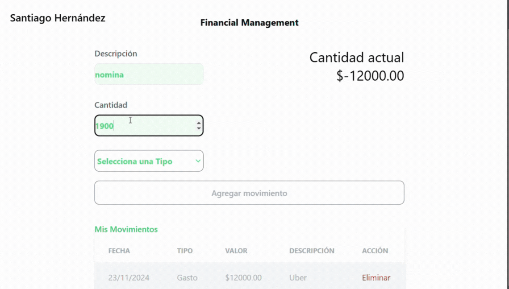

# Formulario de Gestión de Movimientos Financieros

Este proyecto es una aplicación de React que permite a los usuarios gestionar movimientos financieros, clasificándolos como **ingresos** o **gastos**, con la posibilidad de agregar, visualizar y eliminar movimientos. Además, se utiliza **Tailwind CSS** para el diseño estilizado y componentes interactivos.
## Vista Previa


## Características

- **Agregar Movimientos**: Los usuarios pueden registrar un ingreso o gasto con descripción, cantidad y tipo.
- **Visualización de Movimientos**: Una tabla muestra los movimientos registrados, junto con la fecha, tipo, valor y descripción.
- **Eliminación de Movimientos**: Los usuarios pueden eliminar movimientos específicos de la tabla.
- **Cálculo Automático**: El saldo actual se actualiza automáticamente al agregar o eliminar movimientos.
- **Estilizado Moderno**: Utiliza Tailwind CSS para una interfaz limpia y responsiva.


## Tecnologías Utilizadas

- **React**: Para construir la interfaz de usuario.
- **Tailwind CSS**: Para el diseño responsivo y estilizado.

## Instalación

1. **Clonar el Repositorio**  
   ```bash
   git clone https://github.com/thiagoh20/Finaciera.git
   cd Financiera
   cd financial-app
   npm install
   npm run dev
## Autor

**Santiago Hernández**  
💻 Desarrollador con experiencia en JavaScript, React, Tailwind CSS, enfocado en crear aplicaciones interactivas.

## Licencia

Este proyecto está bajo la Licencia MIT. Puedes usarlo y modificarlo según tus necesidades.